

  
  
  
  
  

---

## What is TERRA COMPUTE?

**TERRA COMPUTE: Race to ASI** is a browser-based grand strategy game where you lead a continent through the most transformative era in human history — from the Cold War of **1960** to the brink of the **Singularity in 2035**. Build infrastructure, research breakthrough technologies, manage resources, outmaneuver rival AI superpowers, and race to become the first nation to achieve **Artificial Superintelligence**.

Every decision matters. Every building changes the trajectory of history. Will you focus on economic dominance, scientific supremacy, or brute military force? The path to ASI is yours to forge.

---

## How to Play

### 1. Select Your Game Mode

| Mode | Year | Description |
|------|------|-------------|
| **PIONEER** | 1960 | Learn the ropes. No rivals. No defeat. Guided tutorials. |
| **ESTRATEGA** | 1980 | The real race begins. 7 AI rivals compete. Every decision matters. |
| **COMPLETO** | 1960 | Complete Estratega to unlock. Full timeline, all systems active. |

### 2. Choose Your Faction

Select one of **8 continents**, each with unique strengths:

- **North America** — +30% Research Speed | GDP: $2,700B
- **Europe** — +20% Tech Transfer | GDP: $1,750B
- **Soviet Union** — +40% Resource Extraction | GDP: $1,250B
- **China** — +50% Population Growth | GDP: $450B
- **Africa** — +60% Solar Potential | GDP: $400B
- **South America** — +25% Renewables | GDP: $500B
- **India** — +40% Labor Force | GDP: $275B
- **Oceania** — +15% Uranium, Defensive | GDP: $250B

### 3. Command Your Empire

Use the **Command Bar** at the bottom:

| Button | Action | Description |
|--------|--------|-------------|
| **BUILD** | Open Building Menu | Construct farms, factories, labs, data centers... |
| **TECH** | Research Tree | Unlock technologies from Nuclear Power to Quantum AI |
| **DIPLO** | Diplomacy Panel | Trade, negotiate, or spy on rivals |
| **ATTACK** | Military Actions | Sabotage rivals, cyberattacks, resource theft |
| **SPY** | Intelligence | Monitor rival progress and steal technology |
| **PAUSE** | Pause/Resume | Time control |

### 4. The 6 Eras of Progress

The game advances through **6 technological eras**, each unlocking new buildings and capabilities:

1. **Foundations** (1960-1975) — Basic agriculture, coal power, early education
2. **Industrial** (1975-1990) — Factories, nuclear energy, mainframe computers
3. **Knowledge** (1990-2000) — Universities, supercomputers, internet infrastructure
4. **Digital** (2000-2015) — Data centers, GPU clusters, social media
5. **AI Era** (2015-2025) — AI factories, chip fabrication, autonomous systems
6. **Singularity** (2025+) — Quantum computing, neural lace, the final race to ASI

### 5. Cinematic Video System

Every major action triggers a **unique cinematic video** on your first encounter:

- **Mode Selection** — 3 videos for Pioneer, Estratega, Completo
- **Faction Selection** — 8 videos for each continent
- **Command Actions** — 6 videos for Build, Tech, Diplo, Attack, Spy, Pause
- **Building Construction** — 20 videos for each building type
- **Historical Events** — 35+ videos for milestone events

Videos play **once** and are remembered via localStorage. Historical events always play their cinematic.

---

## Building Cards

Construct these buildings to grow your empire. Each building card shows cost, effects, and unlock requirements.

### Population

| Card | Building | Cost | Effect |
|------|----------|------|--------|
| 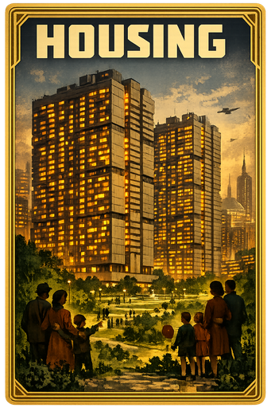 | **Housing** | $50B | +10K Population, +5 Jobs |
| 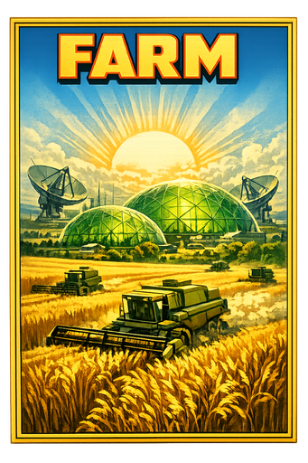 | **Farm** | $30B | +100 Food, +2K Jobs |
| 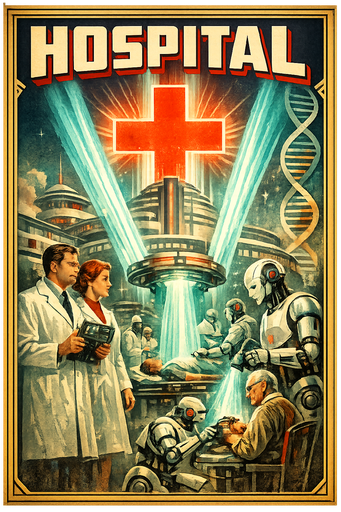 | **Hospital** | $80B | +5% Health, -2% Death Rate |

### Economy

| Card | Building | Cost | Effect |
|------|----------|------|--------|
| 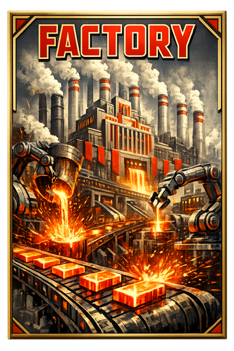 | **Factory** | $100B | +$20B GDP, +5K Jobs |
| 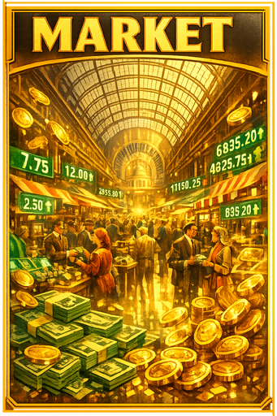 | **Market** | $60B | +10% Trade, +$5B GDP |
| 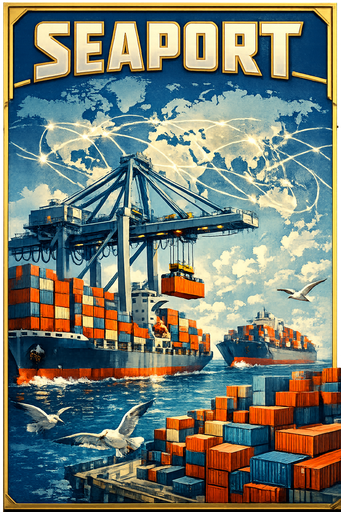 | **Seaport** | $150B | +25% Trade, +$15B GDP |

### Education & Research

| Card | Building | Cost | Effect |
|------|----------|------|--------|
| 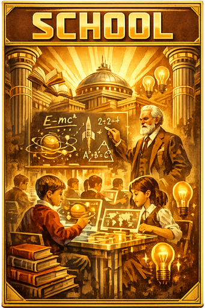 | **School** | $40B | +2% Education, +1K Jobs |
| 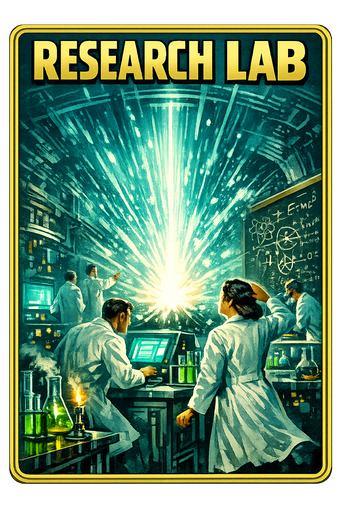 | **Research Lab** | $200B | +10% Research Speed, +50 Compute |
| 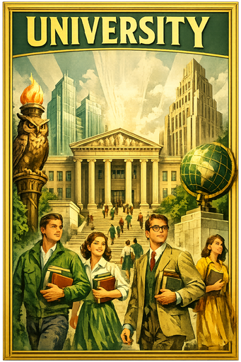 | **University** | $500B | +15% Education, +200 Compute |

### Energy

| Card | Building | Cost | Effect |
|------|----------|------|--------|
| 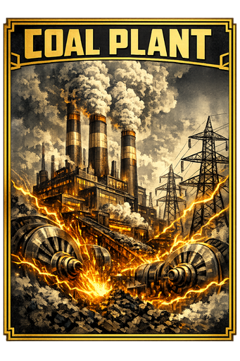 | **Coal Plant** | $80B | +500 Energy, -2% Environment |
| 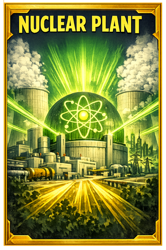 | **Nuclear** | $400B | +2,000 Energy, Requires Uranium |
| 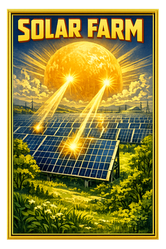 | **Solar Farm** | $300B | +1,000 Energy, Clean |

### Computing (The Path to ASI)

| Card | Building | Cost | Era | Effect |
|------|----------|------|-----|--------|
| 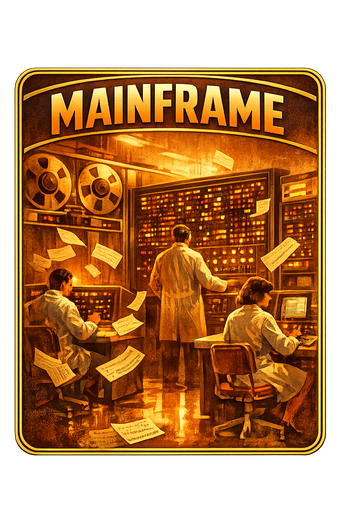 | **Mainframe** | $500B | Industrial | +1K Compute |
| 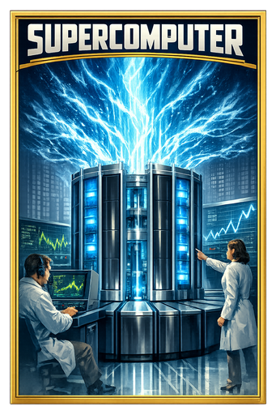 | **Supercomputer** | $2,000B | Knowledge | +100K Compute |
| 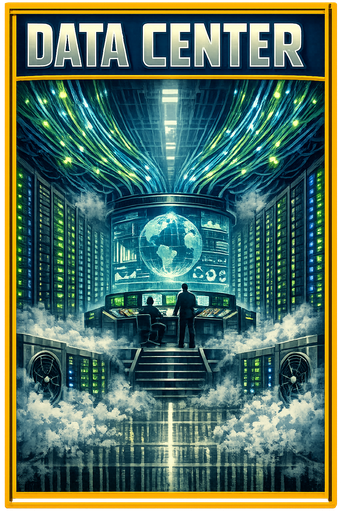 | **Data Center** | $5,000B | Digital | +10M Compute |
| 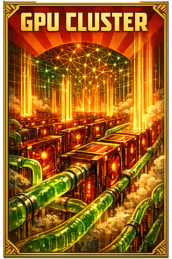 | **GPU Cluster** | $20,000B | AI Era | +1T Compute |
| 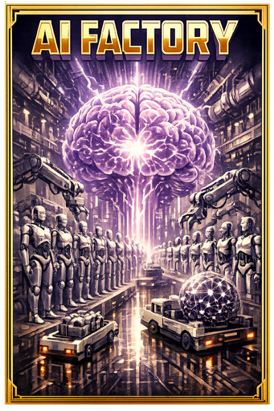 | **AI Factory** | $50,000B | AI Era | +100T Compute |
| 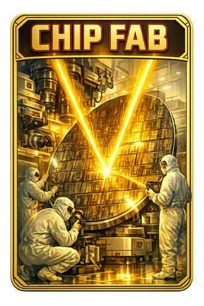 | **Chip Fab** | $30,000B | AI Era | +50% Chip Production |

### Defense

| Card | Building | Cost | Effect |
|------|----------|------|--------|
| 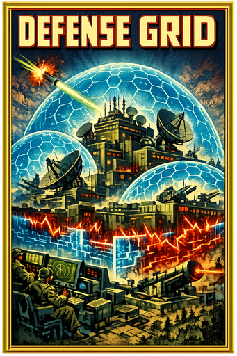 | **Defense Grid** | $1,000B | Cyber defense, Anti-sabotage |
| 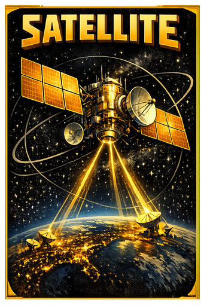 | **Satellite** | $2,000B | Intelligence, +10% Research |

---

## Action Cards

| Card | Action | Key | Description |
|------|--------|-----|-------------|
| 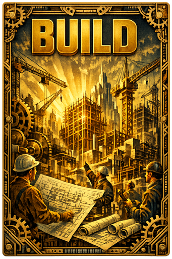 | **BUILD** | B | Open building construction menu |
| 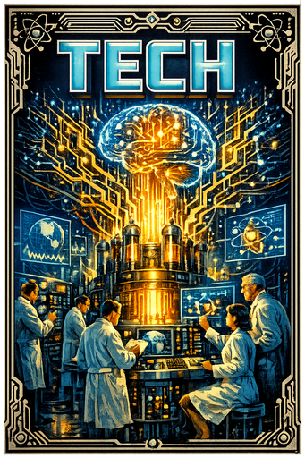 | **TECH** | T | View and research technologies |
| 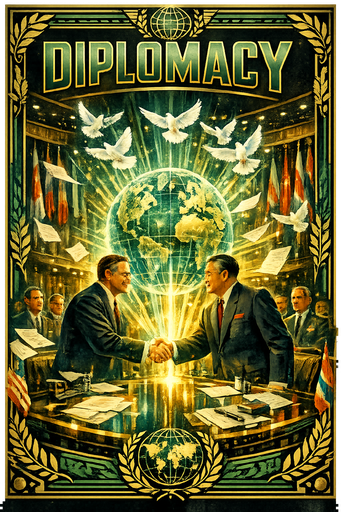 | **DIPLOMACY** | D | Trade, negotiate, form alliances |
| 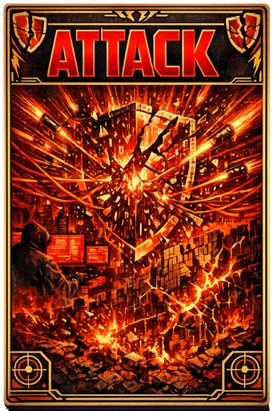 | **ATTACK** | A | Military and cyber operations |
| 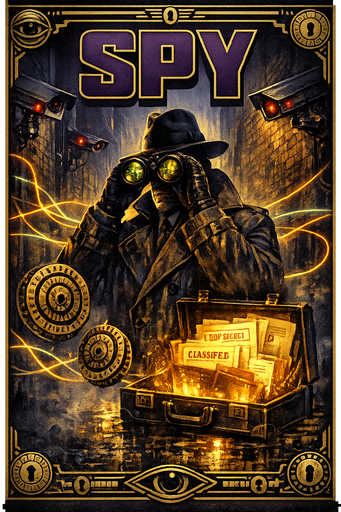 | **SPY** | S | Espionage and intelligence |
| 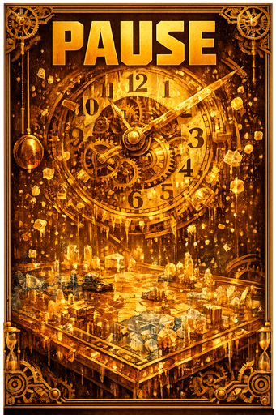 | **PAUSE** | Space | Pause or resume the game |

---

## Historical Event Cards

Throughout your journey, **historical events** will reshape the world. Each event comes with a cinematic video and gameplay consequences.

### AI Milestones

| Year | Event | Effect |
|------|-------|--------|
| 1950 | **Turing Test** | The foundation of AI thinking |
| 1956 | **Dartmouth Workshop** | AI officially named and born |
| 1958 | **Perceptron** | First neural network |
| 1965 | **Moore's Law** | Computing power doubles every 2 years |
| 1966 | **ELIZA** | First conversational AI |
| 1974 | **First AI Winter** | Funding cuts, skepticism |
| 1980 | **Expert Systems** | AI enters business |
| 1986 | **Autonomous Vehicles** | Self-driving research begins |
| 1997 | **Deep Blue** | AI defeats world chess champion |
| 2011 | **IBM Watson** | AI wins Jeopardy! |
| 2012 | **AlexNet** | Deep learning revolution |
| 2016 | **AlphaGo** | AI masters Go |
| 2017 | **Transformers** | The architecture that changed everything |
| 2020 | **GPT-3** | Large language models emerge |
| 2022 | **ChatGPT** | AI goes mainstream |
| 2023 | **Multimodal AI** | AI sees, hears, and understands |
| 2024 | **AI Agents** | Autonomous AI systems |
| 2025 | **Agentic AI** | AI that acts on its own |
| 2027 | **Beyond Moore** | Quantum-classical hybrid computing |

### World Events

| Year | Event | Effect |
|------|-------|--------|
| 1973 | **Oil Crisis** | Energy costs spike, GDP drops |
| 1991 | **End of Cold War** | New tech sharing opportunities |
| 2001 | **Dot-Com Crash** | Tech sector turmoil |
| 2001 | **September 11** | Defense spending increases |
| 2001 | **China Joins WTO** | Manufacturing shifts east |
| 2008 | **Financial Crisis** | Global recession |
| 2020 | **COVID-19 Pandemic** | Remote work boom, AI acceleration |
| 2022 | **War in Ukraine** | Energy crisis, chip shortage |
| 2023 | **Chip War** | Semiconductor race intensifies |
| 2023 | **AI Boom** | Massive investment in AI |

---

## Faction Cards

Each continent has a unique propaganda-style card with special bonuses:

| Faction | Card | Special Bonus |
|---------|------|---------------|
| **North America** | 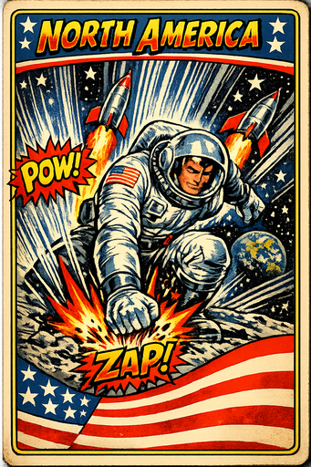 | +30% Research Speed |
| **Europe** | 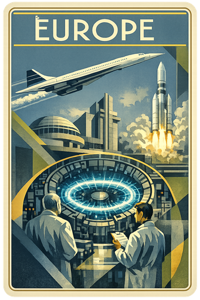 | +20% Tech Transfer |
| **Soviet Union** | 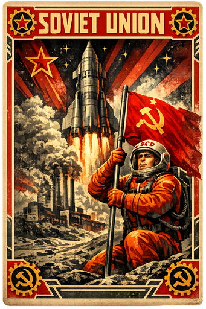 | +40% Resource Extraction |
| **China** | 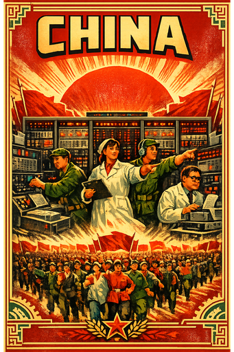 | +50% Population Growth |
| **Africa** | 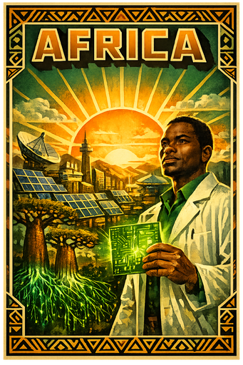 | +60% Solar Potential |
| **South America** | 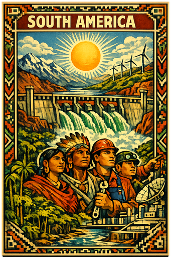 | +25% Renewables |
| **India** | 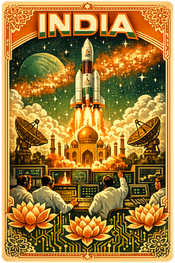 | +40% Labor Force |
| **Oceania** | 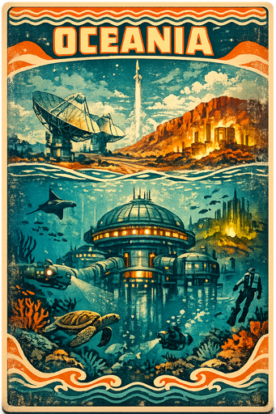 | +15% Uranium, Defensive |

---

## Game Mechanics

### Resources
- **GDP** — Economic power. Used to build and research.
- **Population** — Workforce. Affected by health, food, and housing.
- **Food** — Must stay above 30% or famine strikes.
- **Energy** — Powers all buildings. Shortages halt production.
- **Compute** — The key metric. Reach 10^30 FLOPS to achieve ASI.
- **Stability** — Internal peace. Below 30% triggers crises.

### Death Conditions (Estratega & Completo)
- Food drops below **10%** for 10+ ticks
- Unemployment exceeds **50%** for 10+ ticks
- Stability below **15%** triggers collapse

### Time Scale
The game uses logarithmic time scaling: **1960 to 2035** in approximately **10 minutes** of real gameplay. Early years pass slowly; the AI era accelerates dramatically.

---

## Sound Design

Immersive era-specific audio:
- **1960s** — Propeller aircraft, early jet engines
- **1970s-80s** — Jet aircraft, Cold War tension
- **1990s** — Supersonic flight, digital revolution
- **2000s** — Modern jet engines, tech boom
- **2010s+** — Drones, electric aircraft, AI hum
- **Satellite Launch** — Rocket liftoff sound
- **Sputnik Beeps** — Occasional satellite transmission sounds

---

## Tech Stack

| Technology | Purpose |
|------------|---------|
| **React 19** | UI framework with concurrent features |
| **TypeScript** | Type-safe development |
| **Vite 7** | Lightning-fast build tooling |
| **Tailwind CSS v3** | Utility-first styling |
| **shadcn/ui** | Component primitives |
| **Web Audio API** | Procedural sound effects |
| **HTML5 Video** | Cinematic playback |
| **Canvas API** | Particle effects and visualizations |
| **Google Translate** | 30+ language support |

---

## Game Data

- **75** Cinematic Videos
- **71** Card Images (PNG)
- **8** Mode/Faction Card Images (JPG)
- **35+** Historical Events
- **20** Building Types
- **6** Action Buttons
- **8** Playable Factions
- **3** Game Modes
- **6** Technological Eras

---

## Credits

**Created by:** Francisco Angulo de Lafuente  
**GitHub:** [@Agnuxo1](https://github.com/Agnuxo1)  
**Built with:** Kimi Agent (AI-assisted development)

**Art Style:** Cold War propaganda poster meets retro-futurism  
**Color Identity:** Phosphor green (#33FF33) on deep black — the glow of the first computer terminals

---

  <strong>THE RACE TO ASI BEGINS NOW</strong> 
  <em>"Whoever achieves artificial superintelligence first will determine the fate of humanity."</em>

  

